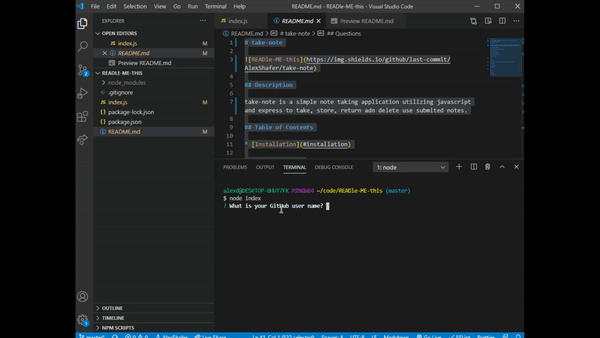
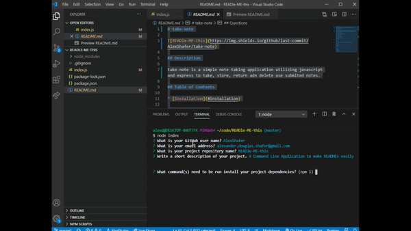

# READle-ME-this

## Description

A Command Line Application to make READMEs easily

## Demo

## Table of Contents

* [Installation](#installation)

* [Usage](#usage)

* [Credits](#credits)

* [License](#license)

## Installation

First clone this repository, then install dependencies with the command:

npm i

To start the application enter the command:

node index.js

Answer the prompts and a README.md will be generated in the current directory.

## Usage

There are no special requirements for using this repo

## Credits

Alex Shafer

## License

MIT

## Tests

undefined

## Questions

